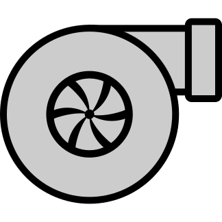
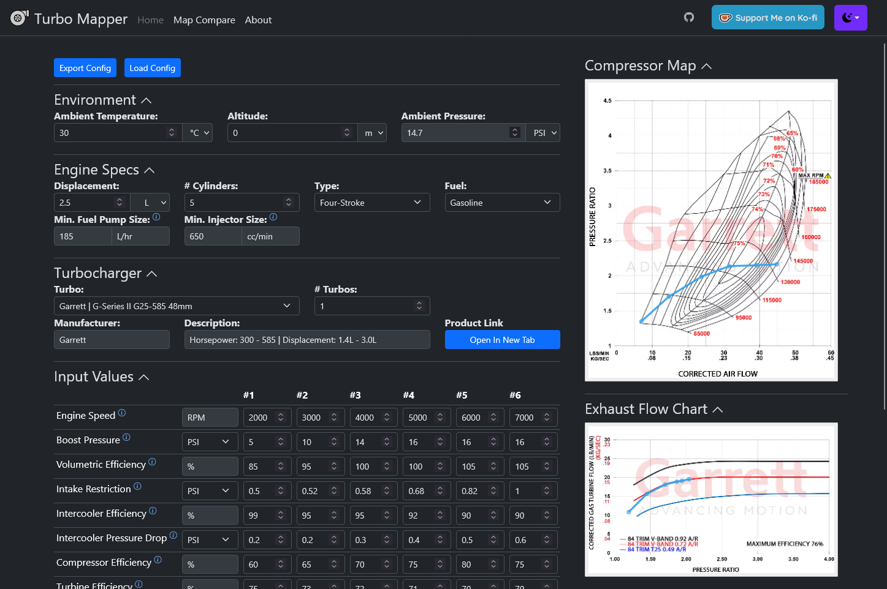

#  Turbo-Mapper

[
    
    
](https://kforth.github.io/Turbo-Mapper/)

Turbo-Mapper is a web-based tool for comparing turbochargers and estimating whether a given setup is suitable for a particular engine build. It helps you evaluate compressor efficiency, turbine flow, fuel requirements, and expected power output in one place.

## Table of contents

- [ Turbo-Mapper](#-turbo-mapper)
  - [Table of contents](#table-of-contents)
  - [Why use Turbo-Mapper?](#why-use-turbo-mapper)
  - [Quick start](#quick-start)
  - [Example](#example)
  - [Development](#development)
  - [Resources](#resources)
  - [Contributing](#contributing)
  - [License](#license)

## Why use Turbo-Mapper?

- Compare turbocharger models from multiple manufacturers.
- Plot target boost and airflow demand lines on compressor maps to check whether a turbo is a good fit.
- Estimate turbine housing flow to help narrow down the right exhaust-side sizing.
- Calculate approximate fuel flow requirements to guide injector and pump selection.
- Estimate engine power and torque output from your input assumptions.

Inspired by [BorgWarner's Matchbot](https://www.borgwarner.com/matchbot/), this project was created to make turbo comparisons easier and more transparent for builds outside the brand-specific toolset.

> Results may vary slightly depending on the assumptions and calculation methods used.

## Quick start

Visit the live site at [Turbo-Mapper](https://kforth.github.io/Turbo-Mapper/) to start exploring turbo options.

## Example

The interface makes it easy to compare turbo options at a glance, from compressor map placement to estimated exhaust flow and power output.

## Development

To run the project locally:

1. Install Ruby dependencies:
   - `bundle install`
2. Install JavaScript dependencies:
   - `npm install`
3. Start the site locally:
   - `bundle exec jekyll serve`
4. Open `http://localhost:4000` in your browser.

## Resources

- NASA Compressor Dynamics: https://www.grc.nasa.gov/www/k-12/airplane/compth.html
- NASA Turbine Thermodynamics: https://www.grc.nasa.gov/www/k-12/airplane/powtrbth.html
- BorgWarner Matchbot: https://www.borgwarner.com/matchbot/
- Garrett Knowledge Center: https://www.garrettmotion.com/knowledge-center-category/oem/expert/

## Contributing

Contributions are welcome. If you have ideas, bug reports, or improvements, please open an issue or submit a pull request.

## License

This project is licensed under the MIT License. See the [LICENSE](LICENSE) file for details.
